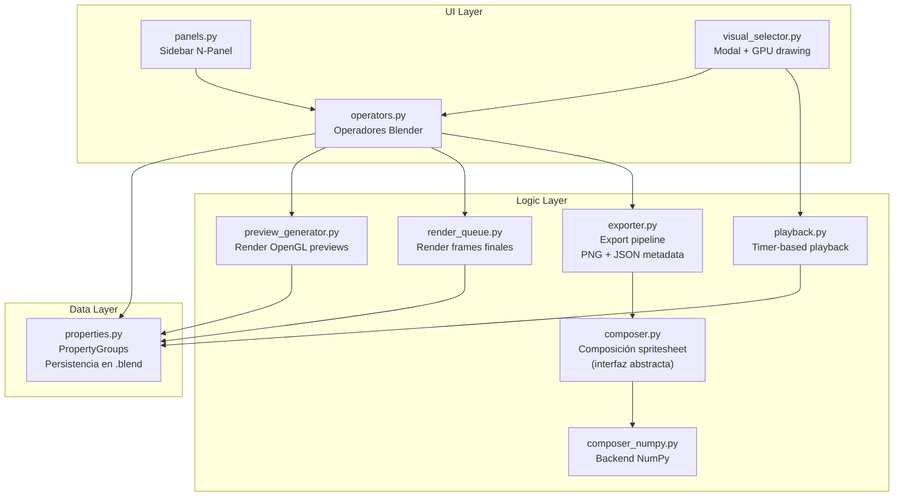

# SpriteSheet Frame Selector — Propuesta de Arquitectura

Propuesta técnica completa para el addon de Blender 5.x. Cubre arquitectura, riesgos, estructura, UI, preview y composición. **No se implementa nada hasta validación.**

---

## User Review Required

> [!IMPORTANT]
> Esta propuesta requiere tu validación en los siguientes puntos antes de implementar:
> 1. ¿Estás de acuerdo con el approach del Visual Selector (modal + GPU drawing)?
> 2. ¿Aceptas NumPy (bundled con Blender) como backend de composición?
> 3. ¿Formato de extensión `blender_manifest.toml` (Blender 5.x nativo) o legacy `bl_info`?
> 4. ¿Preview vía `bpy.ops.render.opengl()` es aceptable para el MVP?

## Open Questions

> [!WARNING]
> **Playback Preview — ubicación**: ¿Preferís que el playback viva dentro del Visual Selector modal (recomendado) o como un popup/modal separado? Dentro del Visual Selector permite iterar más rápido (seleccionar → play → ajustar → play). Un modal separado sería más simple de implementar pero añade fricción.

> [!NOTE]
> **Cache folder**: El MVP usaría una subcarpeta temporal controlada por el addon (ej. `//spritesheet_cache/` relativa al .blend, o `tempfile` si el .blend no está guardado). ¿Preferís alguna convención específica?

---

## 1. Arquitectura General

### Principio rector
Cada responsabilidad vive en su propio módulo. Las dependencias fluyen en una sola dirección: **Data → Logic → UI**. Ningún módulo de lógica importa UI. La UI solo lee data y llama operadores.

### Diagrama de capas



### Desacoplamiento del Composer

El compositor de spritesheet se diseña detrás de una **interfaz abstracta** (protocol/ABC):

```python
# composer.py — Interfaz
class ComposerBackend:
    def compose(self, frame_paths: list[str], frame_w: int, frame_h: int,
                columns: int, padding: int, margin: int,
                output_path: str) -> bool:
        """Compone spritesheet PNG. Retorna True si exitoso."""
        raise NotImplementedError
```

El MVP implementa `ComposerNumpy`. En el futuro se puede reemplazar por un backend con Pillow, C extension, o GPU compute sin tocar el resto del código.

### Flujo de datos principal

```
Clip (PropertyGroup en Scene)
  ├── frame_start, frame_end, frame_step
  ├── camera (PointerProperty)
  ├── frames[] (CollectionProperty<FrameItem>)
  │     ├── frame_number
  │     ├── selected (bool)
  │     └── preview_path (string → cached PNG)
  └── preview_size, cache_dirty, etc.

ExportSettings (PropertyGroup en Scene)
  ├── frame_width, frame_height
  ├── columns, padding, margin
  ├── output_folder, sheet_name
  └── export_png_sequence, transparent
```

Todo persiste en `.blend` automáticamente vía `CollectionProperty` / `PointerProperty` en `bpy.types.Scene`.

---

## 2. Riesgos Técnicos

### 🔴 Riesgo ALTO

| Riesgo | Impacto | Mitigación |
|--------|---------|------------|
| **`bpy.ops.render.opengl()` requiere contexto 3D Viewport** | No funciona en background render ni desde contextos no-3D | Validar contexto antes de ejecutar. Mostrar error claro si se ejecuta desde un contexto incorrecto. Para el MVP es aceptable: el usuario siempre tiene un 3D Viewport abierto. |
| **Modal operator bloquea interacción con otros paneles** | Mientras el Visual Selector está abierto, el usuario no puede interactuar con el sidebar | Esto es comportamiento estándar de modals en Blender. El modal debe tener controles internos suficientes (select all, deselect, play, etc.). Escape para cerrar. |
| **Imágenes bottom-up en Blender** | `image.pixels` almacena desde abajo-izquierda. Un error de orientación produce spritesheets invertidas | Tests tempranos con frames reales. Función helper `flip_rows()` si es necesario. |

### 🟡 Riesgo MEDIO

| Riesgo | Impacto | Mitigación |
|--------|---------|------------|
| **Performance de `foreach_set` para sheets grandes** | Un spritesheet de 4096x4096 = 67M floats. `foreach_set` puede tardar ~100-200ms | Aceptable para export (no es tiempo real). Si se necesita, poolear en chunks. Warning en UI si sheet > 4096x4096. |
| **`draw_texture_2d` con muchos thumbnails** | Dibujar 100+ texturas en un modal puede causar lag | Implementar viewport culling: solo dibujar thumbnails visibles. Limitar redraws con `tag_redraw()` condicional. |
| **`bpy.ops.render.opengl` modifica settings de escena** | Si el addon crashea durante preview gen, los settings quedan sucios | Usar `try/finally` para restaurar. Guardar snapshot de settings antes de modificar. |
| **Preview cache invalidation** | No hay detección automática de cambios en escena | No intentar auto-detectar. Warning estático "Preview may be outdated" + botón Refresh manual. Consistente con filosofía del proyecto. |

### 🟢 Riesgo BAJO

| Riesgo | Impacto | Mitigación |
|--------|---------|------------|
| **NumPy no disponible** | Casi imposible: viene bundled con Blender | Fallback a Python puro como safety net (muy lento, solo emergency) |
| **`blender_manifest.toml` cambios en futuras versiones** | Schema es `1.0.0`, probablemente estable | Seguir especificación oficial. Fácil de actualizar. |
| **Persistencia de datos huérfanos** | Si se desinstala el addon, los PropertyGroups persisten en .blend | No es un problema funcional. Documentar en README. |

---

## 3. Estructura del Addon

```
spritesheet_frame_selector/
├── blender_manifest.toml           # Metadata del extension (Blender 5.x)
├── __init__.py                      # register/unregister principal
│
├── properties.py                    # PropertyGroups (Data Model completo)
│   ├── SpriteSheetFrameItem         #   frame_number, selected, preview_path
│   ├── SpriteSheetClip              #   name, range, step, camera, frames[]
│   ├── SpriteSheetExportSettings    #   dimensions, columns, padding, output
│   └── SpriteSheetPlaybackState     #   is_playing, current_index, fps, loop
│
├── operators.py                     # Todos los operadores
│   ├── SPRITESHEET_OT_add_clip
│   ├── SPRITESHEET_OT_remove_clip
│   ├── SPRITESHEET_OT_duplicate_clip
│   ├── SPRITESHEET_OT_generate_preview
│   ├── SPRITESHEET_OT_refresh_preview
│   ├── SPRITESHEET_OT_clear_cache
│   ├── SPRITESHEET_OT_open_visual_selector
│   ├── SPRITESHEET_OT_select_all
│   ├── SPRITESHEET_OT_deselect_all
│   ├── SPRITESHEET_OT_invert_selection
│   ├── SPRITESHEET_OT_select_every_n
│   ├── SPRITESHEET_OT_export_clip
│   ├── SPRITESHEET_OT_export_all_clips      # Post-MVP, estructura lista
│   ├── SPRITESHEET_OT_playback_play
│   ├── SPRITESHEET_OT_playback_stop
│   └── SPRITESHEET_OT_export_png_sequence
│
├── panels.py                        # UI Sidebar (N-Panel)
│   ├── SPRITESHEET_PT_main           #   Panel principal
│   ├── SPRITESHEET_PT_clips          #   Lista de clips + settings
│   ├── SPRITESHEET_PT_preview        #   Preview controls + status
│   ├── SPRITESHEET_PT_selection      #   Selection summary + actions
│   └── SPRITESHEET_PT_export         #   Export settings + button
│
├── visual_selector.py               # Modal operator + GPU drawing
│   └── SPRITESHEET_OT_visual_selector
│       ├── Grid rendering (draw_texture_2d)
│       ├── Selection overlay (GPU shader)
│       ├── Mouse input (click, drag)
│       ├── Keyboard shortcuts
│       ├── Frame numbers (blf)
│       ├── Scroll/pan
│       └── Playback integration
│
├── preview_generator.py             # Lógica de generación de previews
│   ├── generate_previews()          #   Render OpenGL por frame
│   ├── get_cache_dir()              #   Resolución de carpeta de cache
│   └── clear_cache()                #   Limpieza de cache
│
├── render_queue.py                  # Render de frames finales para export
│   └── render_selected_frames()     #   Render solo frames seleccionados
│
├── composer.py                      # Interfaz abstracta de composición
│   └── ComposerBackend (ABC)
│
├── composer_numpy.py                # Backend NumPy (default, sin deps)
│   └── NumpyComposer
│       ├── compose()                #   Composición con numpy arrays
│       └── _load_frame_pixels()     #   Carga via bpy.data.images
│
├── exporter.py                      # Pipeline de export completo
│   ├── export_single_clip()
│   ├── export_all_clips()           #   Multi-clip atlas
│   └── write_metadata_json()        #   JSON metadata writer
│
├── playback.py                      # Playback preview con timers
│   ├── start_playback()
│   ├── stop_playback()
│   └── _playback_tick()             #   Timer callback
│
└── utils.py                         # Helpers compartidos
    ├── save_render_settings()
    ├── restore_render_settings()
    ├── get_selected_frames()
    ├── calculate_sheet_dimensions()
    └── validate_export_settings()
```

### `blender_manifest.toml`

```toml
schema_version = "1.0.0"
id = "spritesheet_frame_selector"
version = "0.1.0"
name = "SpriteSheet Frame Selector"
tagline = "Visual frame selection and spritesheet export for animations"
maintainer = "Developer <dev@example.com>"
type = "add-on"
blender_version_min = "5.0.0"
license = ["SPDX:GPL-3.0-or-later"]

[permissions]
files = "Export spritesheets and cache preview images to disk"
```

### Orden de registro

```python
# __init__.py
def register():
    # 1. PropertyGroups (hijos primero, padres después)
    properties.register()   # FrameItem → Clip → ExportSettings → Scene props
    # 2. Operadores
    operators.register()
    # 3. UI
    panels.register()

def unregister():
    panels.unregister()
    operators.unregister()
    properties.unregister()
```

---

## 4. Estrategia de UI

### 4.1 Sidebar (N-Panel)

Ubicación: `3D Viewport > Sidebar > SpriteSheet`

```
┌─────────────────────────────────┐
│  SPRITESHEET FRAME SELECTOR     │
├─────────────────────────────────┤
│  ▼ Clips                        │
│  ┌─────────────────────────────┐│
│  │ ● idle         [1-20 s1]   ││
│  │   walk         [21-40 s1]  ││
│  │   attack       [41-55 s2]  ││
│  └─────────────────────────────┘│
│  [+ Add] [- Remove] [⧉ Dup]    │
├─────────────────────────────────┤
│  ▼ Active Clip: idle            │
│  Frame Start: [1    ]           │
│  Frame End:   [20   ]           │
│  Frame Step:  [1    ]           │
│  Camera:      [Scene Camera ▼]  │
├─────────────────────────────────┤
│  ▼ Preview                      │
│  Size: [64x64 ▼]  (32/64/128)  │
│  [Generate Preview]             │
│  [Refresh Preview]              │
│  [Clear Cache]                  │
│  Status: ✓ 20 frames cached    │
│  ⚠ Preview may be outdated     │
├─────────────────────────────────┤
│  ▼ Selection                    │
│  [Open Visual Selector]         │
│  ─────────────────────────      │
│  Total frames:    20            │
│  Selected frames: 12            │
│  [Select All] [Deselect All]    │
│  [Invert] [Every N: [2] Go]    │
├─────────────────────────────────┤
│  ▼ Export                       │
│  Frame Width:  [64  ]           │
│  Frame Height: [64  ]           │
│  Columns:      [6   ]           │
│  Padding:      [0   ]           │
│  Margin:       [0   ]           │
│  Background:   [Transparent ▼]  │
│  ─────────────────────────      │
│  Est. rows: 2                   │
│  Est. sheet: 384 x 128          │
│  ⚠ Sheet > 4096: No            │
│  ─────────────────────────      │
│  Output: [/path/to/folder  📁]  │
│  Name:   [character_idle    ]   │
│  □ Export PNG sequence           │
│  ─────────────────────────      │
│  [▶ EXPORT SPRITESHEET]         │
│  [▶ Export All Clips]  (grayed) │
└─────────────────────────────────┘
```

### 4.2 Visual Selector (Modal)

El Visual Selector es un **modal operator** que dibuja sobre el 3D Viewport usando el módulo `gpu`. No es una ventana flotante externa — es un overlay que toma control del viewport.

**¿Por qué modal + GPU y no una ventana Blender nativa?**
- Blender no ofrece API para crear ventanas con grillas interactivas custom
- `UILayout` no soporta grids de thumbnails clickeables con drag/selection
- Los modals con `draw_handler_add` + `gpu` son la forma estándar de hacer UIs custom ricas en Blender
- Permiten control total: mouse tracking, keyboard, GPU-rendered thumbnails, overlays

**Comportamiento del modal:**

```
┌───────────────────────────────────────────────────────────────┐
│  VISUAL FRAME SELECTOR — idle (12/20 selected)     [ESC]     │
│  [Select All] [Deselect] [Invert] [Every N] [▶ Play] [⏹]    │
├───────────────────────────────────────────────────────────────┤
│                                                               │
│  ┌──────┐ ┌──────┐ ┌──────┐ ┌──────┐ ┌──────┐ ┌──────┐     │
│  │ ░░░░ │ │ ████ │ │ ████ │ │ ░░░░ │ │ ████ │ │ ████ │     │
│  │ ░░░░ │ │ ████ │ │ ████ │ │ ░░░░ │ │ ████ │ │ ████ │     │
│  │  F1  │ │  F2  │ │  F3  │ │  F4  │ │  F5  │ │  F6  │     │
│  └──────┘ └──────┘ └──────┘ └──────┘ └──────┘ └──────┘     │
│                                                               │
│  ┌──────┐ ┌──────┐ ┌──────┐ ┌──────┐ ┌──────┐ ┌──────┐     │
│  │ ████ │ │ ░░░░ │ │ ████ │ │ ████ │ │ ░░░░ │ │ ████ │     │
│  │ ████ │ │ ░░░░ │ │ ████ │ │ ████ │ │ ░░░░ │ │ ████ │     │
│  │  F7  │ │  F8  │ │  F9  │ │ F10  │ │ F11  │ │ F12  │     │
│  └──────┘ └──────┘ └──────┘ └──────┘ └──────┘ └──────┘     │
│                                                               │
│  ████ = seleccionado    ░░░░ = no seleccionado (dimmed)       │
└───────────────────────────────────────────────────────────────┘
```

**Interacciones implementadas por prioridad:**

| Prioridad | Interacción | Implementación |
|-----------|-------------|----------------|
| P0 (MVP) | Click toggle | Hit-test en grid → toggle `frame.selected` |
| P0 (MVP) | Select All / Deselect All / Invert | Keyboard shortcuts (A, D, I) + botones GPU |
| P0 (MVP) | Select Every N | Keyboard shortcut (N) → mini input |
| P1 | Drag select (paint) | `MOUSEMOVE` + `lmb_held` → seleccionar celdas bajo cursor |
| P1 | Ctrl+drag deselect | `MOUSEMOVE` + `lmb_held` + `ctrl` → deseleccionar |
| P2 | Shift+click range | Recordar último click → seleccionar rango |
| P3 | Box/marquee select | Dibujar rectángulo → seleccionar intersección |

**Scroll/zoom:**
- Scroll wheel: pan vertical (para grids con muchas filas)
- No zoom por ahora (tamaño fijo = preview_size)

**Rendering del modal (GPU):**

```python
# Por cada frame visible:
1. gpu.texture.from_image(preview_image)    # Cargar textura
2. draw_texture_2d(texture, pos, w, h)      # Dibujar thumbnail

# Overlay de selección:
3. batch_for_shader('UNIFORM_COLOR')        # Rectángulo semi-transparente
   - Seleccionado: borde verde/azul brillante
   - No seleccionado: overlay oscuro semi-transparente (dim)

# Texto:
4. blf.draw() para número de frame
```

**Optimización:** Solo dibujar celdas visibles (viewport culling basado en scroll offset y tamaño de región).

### 4.3 Playback dentro del Visual Selector

El playback se integra directamente en el Visual Selector modal:

1. Usuario presiona `Space` o botón `▶ Play`
2. Se registra `bpy.app.timers.register()` con intervalo `1.0 / fps`
3. El timer callback avanza un índice sobre los frames seleccionados
4. El draw callback dibuja el frame actual más grande o con highlight
5. `Space` de nuevo o `⏹` para detener
6. El timer se desregistra

**El playback NO mueve el frame de la escena.** Solo cicla un índice interno que cambia qué thumbnail se muestra highlighted/ampliado en el modal. Esto es instantáneo y no afecta nada en la escena.

**Modo playback en el modal:**

```
┌─────────────────────────────────────────────────┐
│  ▶ PLAYING — idle — F5 (4/12) — 12 FPS  [⏹]   │
├─────────────────────────────────────────────────┤
│         ┌──────────────────┐                     │
│         │                  │                     │
│         │   FRAME 5        │  ← Frame actual     │
│         │   (ampliado)     │     ampliado         │
│         │                  │                     │
│         └──────────────────┘                     │
│                                                  │
│  [F2] [F3] [F5] [F6] [F7] [F9]...  ← strip     │
└─────────────────────────────────────────────────┘
```

---

## 5. Estrategia de Preview

### 5.1 Generación

**Método:** `bpy.ops.render.opengl(write_still=True)`

**Flujo:**

```python
def generate_previews(clip, context):
    scene = context.scene
    render = scene.render

    # 1. Guardar settings originales
    original = save_render_settings(render)

    try:
        # 2. Configurar para preview
        render.resolution_x = clip.preview_size
        render.resolution_y = clip.preview_size
        render.resolution_percentage = 100
        render.image_settings.file_format = 'PNG'
        render.image_settings.color_mode = 'RGBA'

        # 3. Activar cámara del clip si se especificó
        if clip.camera:
            scene.camera = clip.camera

        cache_dir = get_cache_dir(clip)

        # 4. Iterar frames
        frames = range(clip.frame_start, clip.frame_end + 1, clip.frame_step)
        for i, frame_num in enumerate(frames):
            scene.frame_set(frame_num)
            filepath = os.path.join(cache_dir, f"frame_{frame_num:05d}.png")
            render.filepath = filepath
            bpy.ops.render.opengl(write_still=True)

            # 5. Actualizar data model
            frame_item = clip.frames[i]
            frame_item.preview_path = filepath

            # 6. Reportar progreso
            progress = (i + 1) / len(frames)
            context.window_manager.progress_update(progress)

    finally:
        # 7. SIEMPRE restaurar
        restore_render_settings(render, original)
        scene.frame_set(original['frame_current'])
```

### 5.2 Cache

| Aspecto | Decisión |
|---------|----------|
| **Ubicación** | `//spritesheet_cache/<clip_name>/` (relativa al .blend). Si .blend no guardado → `tempfile.mkdtemp()` |
| **Formato** | PNG con alpha, tamaño = `preview_size × preview_size` |
| **Naming** | `frame_NNNNN.png` (zero-padded 5 digits) |
| **Invalidación** | Manual solamente. `cache_dirty` flag + warning en UI |
| **Refresh** | Regenera todos los previews del clip activo |
| **Clear** | Borra carpeta de cache completa del clip |
| **Persistencia** | `preview_path` se guarda en PropertyGroup → sobrevive save/load |

### 5.3 Carga en GPU para Visual Selector

```python
# Al abrir el Visual Selector:
for frame in clip.frames:
    if frame.preview_path and os.path.exists(frame.preview_path):
        img = bpy.data.images.load(frame.preview_path, check_existing=True)
        img.name = f"spritesheet_preview_{frame.frame_number}"
        # La textura se crea on-demand en el draw callback via gpu.texture.from_image()
```

Las imágenes se cargan en `bpy.data.images` al abrir el selector y se eliminan al cerrar, para no contaminar el .blend.

### 5.4 Sidebar thumbnails (complementario)

Para mostrar un thumbnail pequeño del clip activo en el sidebar sin abrir el modal:

```python
# Usar bpy.utils.previews.ImagePreviewCollection
pcoll = bpy.utils.previews.new()
pcoll.load("clip_thumb", first_frame_path, 'IMAGE')
layout.template_icon(pcoll["clip_thumb"].icon_id, scale=4.0)
```

Esto es secundario — el Visual Selector es la interfaz principal.

---

## 6. Estrategia de Spritesheet Composition

### 6.1 Interfaz abstracta

```python
# composer.py
from abc import ABC, abstractmethod

class ComposerBackend(ABC):
    @abstractmethod
    def compose(
        self,
        frame_paths: list[str],
        frame_width: int,
        frame_height: int,
        columns: int,
        padding: int = 0,
        margin: int = 0,
        output_path: str = "",
        transparent: bool = True,
    ) -> bool:
        """
        Compone spritesheet a partir de lista ordenada de frames renderizados.
        Returns True si exitoso.
        """
        ...

    def calculate_dimensions(self, n_frames, frame_w, frame_h, columns, padding, margin):
        rows = (n_frames + columns - 1) // columns
        sheet_w = margin * 2 + columns * frame_w + max(0, columns - 1) * padding
        sheet_h = margin * 2 + rows * frame_h + max(0, rows - 1) * padding
        return sheet_w, sheet_h, rows
```

### 6.2 Backend NumPy (MVP)

**¿Por qué NumPy?**
- Viene bundled con Blender — cero dependencias externas
- `foreach_get/set` + NumPy array = operaciones vectorizadas, órdenes de magnitud más rápido que pixel-by-pixel
- Para un spritesheet típico (64×64, 20 frames, 6 columnas) la composición toma < 50ms
- Incluso para sheets de 4096×4096 el tiempo es < 200ms

**Flujo de composición:**

```python
# composer_numpy.py
import numpy as np
import bpy

class NumpyComposer(ComposerBackend):
    def compose(self, frame_paths, frame_width, frame_height,
                columns, padding=0, margin=0, output_path="",
                transparent=True):

        n_frames = len(frame_paths)
        sheet_w, sheet_h, rows = self.calculate_dimensions(
            n_frames, frame_width, frame_height, columns, padding, margin
        )

        # 1. Crear buffer (RGBA float32, inicializado a transparente)
        sheet = np.zeros((sheet_h, sheet_w, 4), dtype=np.float32)
        if not transparent:
            sheet[:, :, 3] = 1.0  # Fondo opaco

        # 2. Componer frames
        for i, path in enumerate(frame_paths):
            frame_img = bpy.data.images.load(path)
            pixels = np.empty(frame_width * frame_height * 4, dtype=np.float32)
            frame_img.pixels.foreach_get(pixels)
            frame_pixels = pixels.reshape((frame_height, frame_width, 4))

            col = i % columns
            row = i // columns

            x = margin + col * (frame_width + padding)
            # Blender images: origin bottom-left
            y = sheet_h - margin - (row + 1) * frame_height - row * padding

            sheet[y:y + frame_height, x:x + frame_width, :] = frame_pixels

            bpy.data.images.remove(frame_img)

        # 3. Crear imagen Blender y guardar
        result = bpy.data.images.new(
            "SpriteSheet_Export", width=sheet_w, height=sheet_h, alpha=True
        )
        result.pixels.foreach_set(sheet.ravel())
        result.update()
        result.filepath_raw = output_path
        result.file_format = 'PNG'
        result.save()

        bpy.data.images.remove(result)
        return True
```

### 6.3 Consideraciones de orientación

> [!CAUTION]
> **Blender almacena imágenes con origen en bottom-left.** La fila 0 del array `pixels` es la fila inferior de la imagen. Esto afecta tanto la lectura de frames como la colocación en el spritesheet. El código de composición debe invertir el eje Y al calcular posiciones. Esto se testea explícitamente.

### 6.4 Reemplazabilidad futura

El patrón es simple:

```python
# exporter.py
from .composer_numpy import NumpyComposer

def get_composer() -> ComposerBackend:
    # Futuro: intentar Pillow, luego fallback
    # try:
    #     from .composer_pillow import PillowComposer
    #     return PillowComposer()
    # except ImportError:
    #     pass
    return NumpyComposer()
```

---

## Proposed Changes

### Resumen de módulos por fase de implementación

#### Fase 1 — Fundación (Data + Preview)

##### [NEW] [blender_manifest.toml](file:///Users/amaruc/Documents/Documentos/Personal_Projects/Developer/spritesheet-blender/spritesheet_frame_selector/blender_manifest.toml)
Metadata del extension para Blender 5.x.

##### [NEW] [__init__.py](file:///Users/amaruc/Documents/Documentos/Personal_Projects/Developer/spritesheet-blender/spritesheet_frame_selector/__init__.py)
Entry point: register/unregister de todos los módulos en orden correcto.

##### [NEW] [properties.py](file:///Users/amaruc/Documents/Documentos/Personal_Projects/Developer/spritesheet-blender/spritesheet_frame_selector/properties.py)
Data model completo: `SpriteSheetFrameItem`, `SpriteSheetClip`, `SpriteSheetExportSettings`, `SpriteSheetPlaybackState`. Registro en `bpy.types.Scene`.

##### [NEW] [utils.py](file:///Users/amaruc/Documents/Documentos/Personal_Projects/Developer/spritesheet-blender/spritesheet_frame_selector/utils.py)
Helpers: save/restore render settings, cálculo de dimensiones, validaciones.

##### [NEW] [preview_generator.py](file:///Users/amaruc/Documents/Documentos/Personal_Projects/Developer/spritesheet-blender/spritesheet_frame_selector/preview_generator.py)
Generación de previews vía OpenGL render. Cache management.

---

#### Fase 2 — UI básica + Operadores core

##### [NEW] [operators.py](file:///Users/amaruc/Documents/Documentos/Personal_Projects/Developer/spritesheet-blender/spritesheet_frame_selector/operators.py)
Todos los operadores: CRUD clips, generate/refresh/clear preview, selection ops, export.

##### [NEW] [panels.py](file:///Users/amaruc/Documents/Documentos/Personal_Projects/Developer/spritesheet-blender/spritesheet_frame_selector/panels.py)
N-Panel sidebar con todas las secciones: clips, preview, selection, export.

---

#### Fase 3 — Visual Selector

##### [NEW] [visual_selector.py](file:///Users/amaruc/Documents/Documentos/Personal_Projects/Developer/spritesheet-blender/spritesheet_frame_selector/visual_selector.py)
Modal operator completo: GPU rendering de grilla, input handling, selection overlays, frame numbers.

---

#### Fase 4 — Export + Composition

##### [NEW] [composer.py](file:///Users/amaruc/Documents/Documentos/Personal_Projects/Developer/spritesheet-blender/spritesheet_frame_selector/composer.py)
Interfaz abstracta `ComposerBackend`.

##### [NEW] [composer_numpy.py](file:///Users/amaruc/Documents/Documentos/Personal_Projects/Developer/spritesheet-blender/spritesheet_frame_selector/composer_numpy.py)
Implementación NumPy del compositor.

##### [NEW] [render_queue.py](file:///Users/amaruc/Documents/Documentos/Personal_Projects/Developer/spritesheet-blender/spritesheet_frame_selector/render_queue.py)
Render de frames finales (solo seleccionados) con settings del usuario.

##### [NEW] [exporter.py](file:///Users/amaruc/Documents/Documentos/Personal_Projects/Developer/spritesheet-blender/spritesheet_frame_selector/exporter.py)
Pipeline completo: render → compose → save PNG → write JSON metadata.

---

#### Fase 5 — Playback + Polish

##### [NEW] [playback.py](file:///Users/amaruc/Documents/Documentos/Personal_Projects/Developer/spritesheet-blender/spritesheet_frame_selector/playback.py)
Timer-based playback: play/stop, loop, FPS configurable. Se integra en el Visual Selector.

---

## Verification Plan

### Automated Tests

```bash
# Test de composición (se puede ejecutar dentro de Blender)
blender --background --python tests/test_composer.py

# Test de persistencia
blender --background --python tests/test_properties.py
```

- Test: crear clip → generar frames → verificar PropertyGroup persistence
- Test: componer spritesheet 3×2 con frames conocidos → verificar dimensiones y pixel positions
- Test: cálculo de dimensiones (rows, sheet size) con edge cases (1 frame, 100 frames, padding, margin)
- Test: orientación bottom-up correcta en composición

### Manual Verification

- Instalar addon en Blender 5.x (macOS + Windows)
- Crear escena simple con animación (cubo rotando)
- Flujo completo: crear clip → generar previews → abrir Visual Selector → seleccionar frames → export → verificar PNG resultante
- Verificar persistencia: guardar .blend → cerrar → reabrir → confirmar que clips y selección persisten
- Verificar playback: seleccionar 5 frames → play → verificar fluidez
- Verificar alpha: exportar con fondo transparente → abrir en editor de imágenes
- Stress test: 100 frames, 128x128, verificar que no bloquea Blender excesivamente
